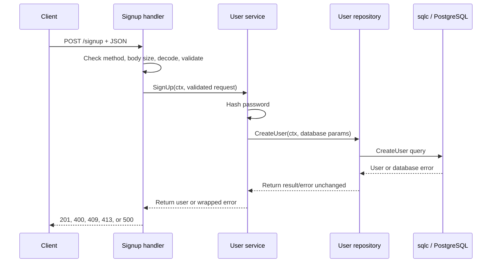

- 1 Set up the database with creds

- 2.1 Create the database schema and queries required (database/query.sql, database/schema.sql)

- 2.2 Create migration scripts using goose (database/migrations/...)

- 3 In main.go connect to the database 

```
ConnectDB(ctx context.Context) (*pgxpool.Pool, error)
```

- 4 Create repository

```
repo interface ->contains Methods that will be used internally

-- THIS IS MOSTLY A TEMPLATE
type sqlcRepository struct {
	queries *database.Queries
}

-- constructor for the interface
func newRepository(queries *database.Queries) repository {
	return sqlcRepository{queries: queries}
}

func (r sqlcRepository) CreateUser(ctx context.Context, arg database.CreateUserParams) (database.User, error) {
	return r.queries.CreateUser(ctx, arg)
}

type svc struct {
	repo repository
}
```

- 5.1 Consume the repo in service

```go
func newService(repo repository) *svc {
	return &svc{repo: repo}
}
```
- 5.2 Use the repo Method in the service

```go
func (s *svc) SignUp(ctx context.Context, request signUpRequest) (database.User, error) {
return s.repo.CreateUser(ctx, database.CreateUserParams{
		Firstname: pgtype.Text{String: request.FirstName, Valid: true},
		Lastname:  pgtype.Text{String: request.LastName, Valid: true},
		Username:  request.Username,
		Password:  pgtype.Text{String: string(passwordHash), Valid: true},
	})
}
```

- 6 Create the endpoint and use the service method

## Signup: request, error, and logging trace

This traces the current `POST /signup` flow through the HTTP handler, service,
repository, and sqlc query. The handler is the HTTP boundary; the service owns
business logic; the repository adapts the service to sqlc. Errors move upward
as return values, and the handler translates them into HTTP responses.



### Current error mapping

| Where the error occurs | Propagation and HTTP result | Logging |
| --- | --- | --- |
| Wrong method | `ValidateMethod` stops the request; `405 Method Not Allowed` with `Allow: POST` | Helper logs `Info` with the received method |
| Invalid JSON / extra JSON value | Handler stops before calling the service; `400 Bad Request` | Not logged; this is a client input error |
| Body exceeds 1 MiB | Handler stops before calling the service; `413 Request Entity Too Large` | Not logged; this is a client input error |
| Required field missing / password exceeds 72 bytes | `validateSignUp` returns an error; handler returns `400 Bad Request` | Not logged; this is a client input error |
| Password hashing fails | Service wraps the error with `hash password`; handler returns `500 Internal Server Error` | Handler logs `could not create user` with the wrapped error |
| Username violates the unique constraint (`23505`) | sqlc returns the PostgreSQL error → repository passes it through → service wraps it with `create user` → handler uses `errors.As` and returns `409 Conflict` | Not logged as an internal failure; duplicate signup is an expected conflict |
| Other database error | sqlc error → repository → service wraps with `create user` → handler returns generic `500` | Handler logs `could not create user` with the wrapped error |
| Response encoding fails | The response has already been marked `201 Created`; it cannot reliably be changed | Handler logs `could not write signup response` |

### Layer responsibilities

1. **Handler (`internal/user/handler.go`)** — Owns HTTP concerns: method,
	request size, JSON decoding, input validation, status codes, and safe client
	messages. It logs unexpected operational failures once, where the error can
	be translated into an HTTP response.
2. **Service (`internal/user/service.go`)** — Owns signup business logic:
	password hashing and user creation. It adds operation context with `%w` and
	returns errors; it does not log them, avoiding duplicate log entries.
3. **Repository (`internal/user/repository.go`)** — Owns persistence
	adaptation. It returns sqlc errors unchanged and does not log. The service
	adds business-operation context, and the handler decides the client result.
4. **sqlc / PostgreSQL** — Executes the query and returns database results or
	errors. Generated database code should not decide HTTP behavior or log.

Do not log request bodies, passwords, password hashes, or other credentials.
Expected client errors (`400`, `409`, and `413`) should not be logged at error
level. If request-level correlation is needed, add a request ID in HTTP
middleware and include it in the handler's structured logs; avoid logging the
same propagated error independently in every layer.

### Example: duplicate username

1. PostgreSQL reports unique-constraint code `23505` from `CreateUser`.
2. The repository returns that error unchanged.
3. `SignUp` wraps it as `create user: ...`, preserving the original cause.
4. The handler's `errors.As` still finds `*pgconn.PgError`, recognizes `23505`,
	and returns `409 Conflict` with `username already exists`.
5. No internal-error log is emitted for this expected conflict.

For an unexpected database failure, steps 1–3 are the same, but the handler
logs the wrapped error once and returns the generic response `could not create
user` with `500 Internal Server Error`.